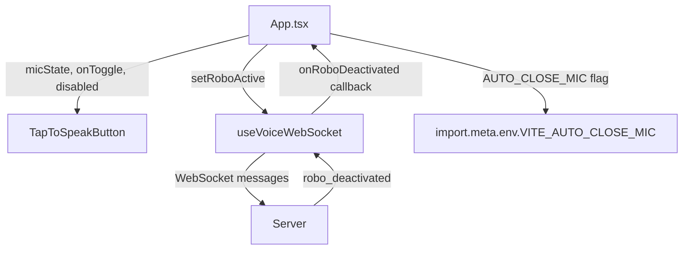

# Design Document — Tap to Speak Button

## Overview

This feature replaces the existing "Activate Robo" toggle button in `ui/src/App.tsx` with a new `TapToSpeakButton` component that provides a clear, mic-centric UX. The button manages a local `micState` (`idle` | `recording`) and wires it to the existing `setRoboActive` call in `useVoiceWebSocket`. An environment flag `VITE_AUTO_CLOSE_MIC` controls whether VAD silence detection (signalled by the server's `robo_deactivated` WebSocket message) automatically resets the mic state back to idle.

No backend files (`server/`, `client/`) are modified. All changes are confined to:

- `ui/src/components/TapToSpeakButton.tsx` (new)
- `ui/src/App.tsx` (modified)
- `ui/src/hooks/useVoiceWebSocket.ts` (modified — expose `onRoboDeactivated` callback)
- `.env` and `.env.example` (new env var entry)

---

## Architecture

The feature introduces a thin state layer (`micState`) that lives in `App.tsx` and is passed down to `TapToSpeakButton` as props. The hook `useVoiceWebSocket` is extended to accept an optional `onRoboDeactivated` callback so that `App` can decide — based on `AUTO_CLOSE_MIC` — whether to reset `micState` when the server signals end-of-turn.



### Data flow — button click

```
User click
  → TapToSpeakButton.onToggle()
    → App: setMicState(idle → recording)  OR  setMicState(recording → idle)
      → setRoboActive(true)  OR  setRoboActive(false)
        → WebSocket: { type: "set_active", active: true/false }
```

### Data flow — auto-close (AUTO_CLOSE_MIC=true)

```
Server emits robo_deactivated
  → useVoiceWebSocket.onmessage handler
    → calls onRoboDeactivated() callback (if provided)
      → App: if (autoCloseMic) setMicState('idle')
```

---

## Components and Interfaces

### `TapToSpeakButton` (`ui/src/components/TapToSpeakButton.tsx`)

A pure presentational + interaction component. It owns no state — all state is passed via props.

```typescript
export type MicState = 'idle' | 'recording';

interface TapToSpeakButtonProps {
  micState: MicState;
  onToggle: () => void;
  disabled?: boolean;
}
```

**Rendering rules:**

| `micState` | Label | `aria-pressed` | `aria-label` | Visual style |
|---|---|---|---|---|
| `idle` | "Tap to Speak" | `false` | "Start recording" | Default (gray) |
| `recording` | "Listening…" | `true` | "Stop recording" | Active (red/pulse) |

The recording state reuses the `animate-pulse` pattern already present in `StatusIndicator.tsx` (the green dot on the LISTENING state). A pulsing red dot is rendered alongside the mic icon when `micState === 'recording'`, consistent with the existing Tailwind animation vocabulary.

**Disabled state:** When `disabled={true}`, the button renders with `opacity-40 cursor-not-allowed` and ignores clicks — matching the existing button's disabled pattern in `App.tsx`.

**Double-open guard:** The `onToggle` handler in `App` checks `micState` before calling `setRoboActive(true)`. If `micState` is already `recording`, the open path is skipped. This prevents double-initialization from rapid programmatic calls.

---

### Changes to `useVoiceWebSocket.ts`

The hook's public interface is extended with one new optional parameter:

```typescript
interface UseVoiceWebSocketOptions {
  onRoboDeactivated?: () => void;
}

export function useVoiceWebSocket(
  options?: UseVoiceWebSocketOptions
): UseVoiceWebSocketReturn
```

Inside the `robo_deactivated` message handler, after the existing `setRoboActiveState(false)` call, the hook calls `options?.onRoboDeactivated?.()`. This keeps the hook's internal `roboActive` state in sync (existing behaviour) while also notifying `App` so it can decide whether to reset `micState`.

The `onclose` handler already calls `setRoboActiveState(false)`. No additional change is needed there — `App` will observe `micState` reset via the `onRoboDeactivated` callback path for the VAD case; the WebSocket close case resets `roboActive` in the hook, and `App` should also reset `micState` in its own `onclose`-equivalent path. To handle this cleanly, the hook also exposes an `onWsClose` optional callback:

```typescript
interface UseVoiceWebSocketOptions {
  onRoboDeactivated?: () => void;
  onWsClose?: () => void;
}
```

`onWsClose` is called from the `ws.onclose` handler (after `setRoboActiveState(false)`), allowing `App` to reset `micState` to `idle` on disconnect.

**No other changes** to the hook's existing logic, return type, or WebSocket message handling.

---

### Changes to `App.tsx`

1. **Import** `TapToSpeakButton` and `MicState`.
2. **Add state**: `const [micState, setMicState] = useState<MicState>('idle')`.
3. **Parse env var** (extracted to a pure helper for testability):
   ```typescript
   function parseAutoCloseMic(value: string | undefined): boolean {
     return value !== 'false';
   }
   const autoCloseMic = parseAutoCloseMic(import.meta.env.VITE_AUTO_CLOSE_MIC);
   ```
4. **Wire hook callbacks**:
   ```typescript
   const { ..., setRoboActive } = useVoiceWebSocket({
     onRoboDeactivated: () => {
       if (autoCloseMic) setMicState('idle');
     },
     onWsClose: () => setMicState('idle'),
   });
   ```
5. **Toggle handler** (with double-open guard):
   ```typescript
   const handleToggle = useCallback(() => {
     if (micState === 'idle') {
       setMicState('recording');
       setRoboActive(true);
     } else {
       setMicState('idle');
       setRoboActive(false);
     }
   }, [micState, setRoboActive]);
   ```
6. **Unmount cleanup** via `useEffect`:
   ```typescript
   useEffect(() => {
     return () => {
       if (micState === 'recording') setRoboActive(false);
     };
   }, [micState, setRoboActive]);
   ```
7. **Replace** the old `<button>` JSX with `<TapToSpeakButton micState={micState} onToggle={handleToggle} disabled={!canToggle} />`.
8. **Remove** `roboActive` from the destructured hook return (it is no longer needed in `App` directly; `micState` is the source of truth for the button).

---

## Data Models

### `MicState`

```typescript
type MicState = 'idle' | 'recording';
```

A simple two-value discriminated union. `idle` is the default and safe state. `recording` means the mic is live and audio is being captured.

### `AUTO_CLOSE_MIC` parsing

```typescript
// Returns true for any value except the exact string "false"
function parseAutoCloseMic(value: string | undefined): boolean {
  return value !== 'false';
}
```

This matches the requirement: absent → `true`, `"true"` → `true`, `"false"` → `false`.

### `UseVoiceWebSocketOptions`

```typescript
interface UseVoiceWebSocketOptions {
  onRoboDeactivated?: () => void;
  onWsClose?: () => void;
}
```

### `.env` / `.env.example` additions

Both files gain a new entry under the `Voice Activity Detection` section:

```dotenv
# Set to false to keep the mic open after VAD silence detection (useful for debugging)
VITE_AUTO_CLOSE_MIC=true
```

---

## Correctness Properties

*A property is a characteristic or behavior that should hold true across all valid executions of a system — essentially, a formal statement about what the system should do. Properties serve as the bridge between human-readable specifications and machine-verifiable correctness guarantees.*

This feature's core logic — the `MicState` toggle state machine and the `parseAutoCloseMic` function — is pure and well-suited to property-based testing. The UI rendering and WebSocket integration layers are covered by example-based tests.

Property-based tests will use [fast-check](https://github.com/dubzzz/fast-check), the standard PBT library for TypeScript/JavaScript.

---

### Property 1: Aria attributes always reflect MicState

*For any* `MicState` value, the rendered `TapToSpeakButton` SHALL have `aria-pressed` equal to `micState === 'recording'` and a non-empty `aria-label` that describes the current action.

**Validates: Requirements 1.6**

---

### Property 2: Open operation is idempotent

*For any* number of `setRoboActive(true)` calls issued while `micState` is already `recording`, the `micState` SHALL remain `recording` and `setRoboActive` SHALL NOT be called again (no double-initialization).

**Validates: Requirements 2.3**

---

### Property 3: Button is disabled for all blocking pipeline states

*For any* `pipelineState` value in `{ 'thinking', 'speaking' }`, the rendered `TapToSpeakButton` SHALL have the `disabled` attribute set and SHALL NOT invoke `onToggle` when clicked.

**Validates: Requirements 2.4**

---

### Property 4: AUTO_CLOSE_MIC env var parsing

*For any* string value `v`, `parseAutoCloseMic(v)` SHALL return `false` if and only if `v === 'false'`; for all other values (including `undefined`) it SHALL return `true`.

**Validates: Requirements 3.2, 3.3**

---

### Property 5: Close always resets micState to idle

*For any* sequence of toggle operations that ends with a close (manual button click while `recording`, `onRoboDeactivated` with `AUTO_CLOSE_MIC=true`, or `onWsClose`), the resulting `micState` SHALL be `idle`.

**Validates: Requirements 6.1, 6.5, 4.1**

---

## Error Handling

| Scenario | Handling |
|---|---|
| `getUserMedia` denied by browser/OS | Catch the `NotAllowedError` / `PermissionDeniedError` in the `handleToggle` open path; call `setMicState('idle')` and `console.warn('Microphone access denied: ', err)`. |
| WebSocket closes while `micState === 'recording'` | `onWsClose` callback resets `micState` to `idle`. |
| App unmounts while `micState === 'recording'` | `useEffect` cleanup calls `setRoboActive(false)`. |
| Rapid double-click (open while already recording) | `handleToggle` checks `micState` before calling `setRoboActive(true)`; redundant open is ignored. |
| `pipelineState` is `thinking` or `speaking` | `disabled={!canToggle}` prevents any click from reaching `handleToggle`. |

---

## Testing Strategy

### Unit / Example-Based Tests

Located in `ui/src/components/__tests__/TapToSpeakButton.test.tsx` and `ui/src/__tests__/App.test.tsx`.

- Render `TapToSpeakButton` with `micState='idle'` → assert label "Tap to Speak"
- Render `TapToSpeakButton` with `micState='recording'` → assert label "Listening…" and pulse class present
- Simulate click from `idle` → assert `onToggle` called once
- Simulate click from `recording` → assert `onToggle` called once
- Render with `disabled={true}` → assert button is disabled and click is ignored
- `parseAutoCloseMic('false')` → `false`
- `parseAutoCloseMic('true')` → `true`
- `parseAutoCloseMic(undefined)` → `true`
- Mock WebSocket `robo_deactivated` with `AUTO_CLOSE_MIC=true` → assert `micState` resets to `idle`
- Mock WebSocket `robo_deactivated` with `AUTO_CLOSE_MIC=false` → assert `micState` stays `recording`
- Mock `getUserMedia` rejection → assert `micState` resets to `idle` and `console.warn` called
- Unmount while `micState='recording'` → assert `setRoboActive(false)` called

### Property-Based Tests

Located in `ui/src/__tests__/tapToSpeak.property.test.ts`.

Uses **fast-check** (`npm install --save-dev fast-check`). Each test runs a minimum of **100 iterations**.

```
// Feature: tap-to-speak-button, Property 1: aria attributes always reflect MicState
// Feature: tap-to-speak-button, Property 2: open operation is idempotent
// Feature: tap-to-speak-button, Property 3: button is disabled for all blocking pipeline states
// Feature: tap-to-speak-button, Property 4: AUTO_CLOSE_MIC env var parsing
// Feature: tap-to-speak-button, Property 5: close always resets micState to idle
```

Each property test is tagged with the format: **Feature: tap-to-speak-button, Property {N}: {property_text}**

### Integration Tests

Not required for this feature — all logic is in-process (no external service calls from the UI layer). The WebSocket interaction is covered by mocking `WebSocket` in unit tests.
