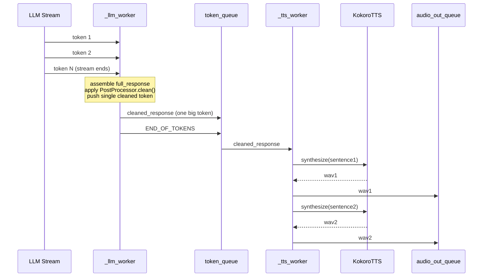
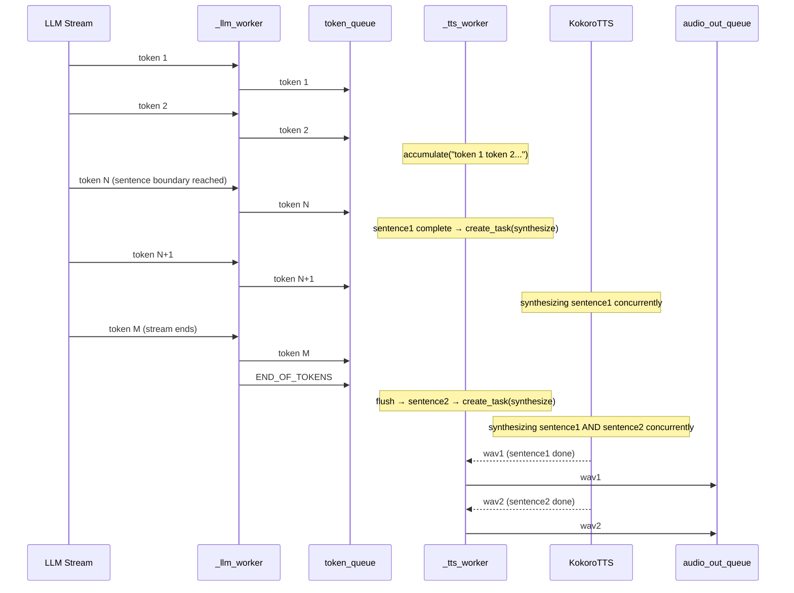
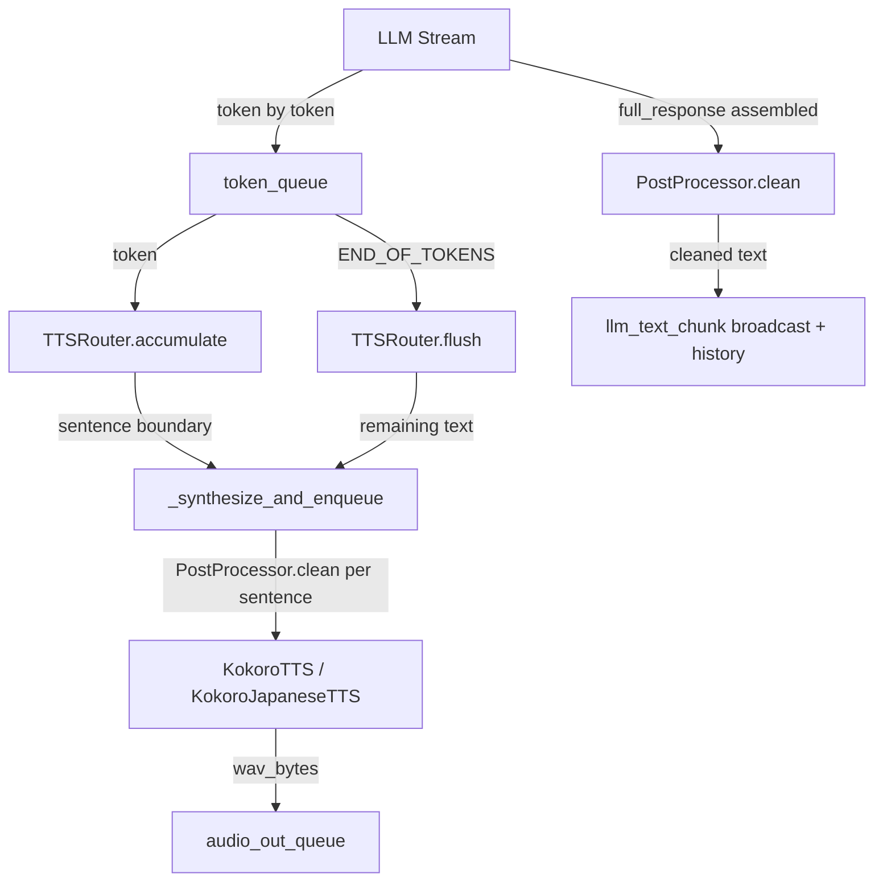

# Design Document: TTS Latency Fix

## Overview

The current voice pipeline buffers the entire LLM response before sending it to TTS, causing a Time-to-First-Audio (TTFA) of ~10 seconds. This design eliminates that bottleneck through three coordinated changes: (1) streaming LLM tokens directly to `token_queue` as they arrive, (2) pipelining concurrent sentence synthesis in `_tts_worker`, and (3) eagerly loading both Kokoro TTS models at server startup. Together these changes target a TTFA under 3 seconds on warm sessions.

The design covers exactly five changes across three files (`server/pipeline.py`, `server/tts/kokoro_tts.py`, `server/main.py`) and leaves `TTSRouter`, `LLMChain`, and all test files untouched.

---

## Architecture

### Current (Buffered) Flow



### Target (Streaming + Pipelined) Flow



---

## Change 1: `_llm_worker` — Streaming Token Dispatch

### Problem

`_run_call2()` collects all tokens into `parts` and returns the full string. The cleaned response is then pushed as a single token. `_tts_worker` cannot begin synthesis until the entire LLM response is assembled.

### Solution

Replace `_run_call2()` with an inline streaming loop that pushes each token to `token_queue` immediately. The `parts` list is still maintained in parallel for history storage and the `llm_text_chunk` broadcast. `PostProcessor.clean()` is applied only to the assembled `full_response` for those two purposes — TTS receives raw per-sentence cleaning via Change 2.

### Pseudocode

```pascal
PROCEDURE _run_streaming_call2(messages, token_queue, parts_out)
  INPUT: messages, token_queue (asyncio.Queue), parts_out (list, mutated in place)
  OUTPUT: none (tokens pushed to queue, parts accumulated in parts_out)

  first_token_logged ← false
  token_count ← 0

  TRY
    FOR EACH token IN self._llm.stream(messages, max_tokens=200, temperature=0.65) DO
      IF self._state.interrupt THEN
        pipeline_event("LLM", "stream_interrupted", tokens_so_far=token_count)
        RETURN  // caller will push END_OF_TOKENS
      END IF

      IF NOT first_token_logged THEN
        ttft_ms ← elapsed_ms(self._speech_end_time)
        pipeline_event("LLM", "call2_first_token", ttft_ms=ttft_ms)
        first_token_logged ← true
      END IF

      AWAIT token_queue.put(token)
      parts_out.append(token)
      token_count ← token_count + 1
    END FOR
  CATCH Exception AS exc
    pipeline_error("LLM", "call2_stream_error", error=str(exc))
  END TRY
END PROCEDURE
```

The outer `_llm_worker` turn block becomes:

```pascal
// --- Call 2: streaming with retry ---
parts ← []
AWAIT _run_streaming_call2(messages, token_queue, parts)
full_response ← "".join(parts)

// Retry once if empty
IF full_response.strip() == "" THEN
  pipeline_warn("LLM", "call2_empty_response_retrying")
  parts ← []
  AWAIT _run_streaming_call2(messages, token_queue, parts)
  full_response ← "".join(parts)
END IF

// Fallback after two failures
IF full_response.strip() == "" THEN
  pipeline_error("LLM", "call2_empty_after_retry_using_fallback")
  AWAIT token_queue.put(_FALLBACK_MESSAGE)
  full_response ← _FALLBACK_MESSAGE
END IF

// Clarification suffix as additional token
IF route_result.clarification_suffix THEN
  suffix_token ← " " + route_result.clarification_suffix
  AWAIT token_queue.put(suffix_token)
  full_response ← full_response + suffix_token
END IF

// Signal end of stream
AWAIT token_queue.put(_END_OF_TOKENS)

// Log turn_complete AFTER END_OF_TOKENS is pushed
cleaned_response ← self._post_processor.clean(full_response, self._state.detected_language)
pipeline_event("LLM", "turn_complete", response_preview=cleaned_response[:60])

// Broadcast cleaned text to UI
AWAIT self._broadcast({"type": "llm_text_chunk", "text": cleaned_response})

// Store history (truncated to 120 words)
IF transcript.text.strip() AND full_response.strip() THEN
  stored_response ← truncate_to_120_words(full_response)
  history.append({"role": "user", "content": transcript.text})
  history.append({"role": "assistant", "content": stored_response})
  WHILE len(history) > _MAX_HISTORY_ENTRIES DO
    history.pop(0); history.pop(0)
  END WHILE
END IF
```

### Key Invariants

- `_END_OF_TOKENS` is pushed **after** all tokens (including suffix) are in the queue.
- `turn_complete` is logged **after** `_END_OF_TOKENS` is pushed (not before, as in the current code).
- `PostProcessor.clean()` is called on `full_response` for UI broadcast and history only — never on individual tokens pushed to `token_queue`.
- The retry loop pushes retry tokens to `token_queue` too, so `_tts_worker` sees them incrementally.
- The interrupt check inside the streaming loop causes an early return; the caller then pushes `_END_OF_TOKENS` to unblock `_tts_worker`.

### Direct-Response Path (Unchanged)

The `route_result.direct_response` branch already pushes a single token + `_END_OF_TOKENS`. No change needed there.

---

## Change 2: `_synthesize_and_enqueue` — Per-Sentence Post-Processing

### Problem

`_synthesize_and_enqueue` receives raw sentence text from `TTSRouter.accumulate()` / `TTSRouter.flush()`. With Change 1, tokens are no longer pre-cleaned before reaching `_tts_worker`, so TTS would receive raw markdown/parenthetical text.

### Solution

Apply `PostProcessor.clean()` to the sentence inside `_synthesize_and_enqueue` before calling `self._tts.synthesize()`. This satisfies the user's Option A decision.

```pascal
PROCEDURE _synthesize_and_enqueue(sentence, sentence_index)
  INPUT: sentence (raw str), sentence_index (int, 0-based within turn)

  // Option A: clean per-sentence before synthesis
  clean_sentence ← self._post_processor.clean(sentence, self._state.detected_language)

  IF clean_sentence == "" THEN
    RETURN  // nothing to synthesize after cleaning
  END IF

  // Req 4.1: log ttfs_ms on first sentence of the turn
  IF sentence_index == 0 THEN
    ttfs_ms ← elapsed_ms(self._speech_end_time)
    tts_log.info("ttfs  session=%s  ttfs_ms=%d", sid, ttfs_ms)
    pipeline_event("TTS", "first_sentence_synthesis_start", ttfs_ms=ttfs_ms)
  END IF

  t_synth_start ← time.monotonic()
  wav_bytes ← AWAIT self._tts.synthesize(clean_sentence, self._state.detected_language)
  synth_ms ← elapsed_ms(t_synth_start)

  IF NOT wav_bytes THEN
    tts_log.warning("empty_wav  session=%s  sentence=%r", sid, clean_sentence[:60])
    RETURN
  END IF

  // Req 4.2: log tts_enqueue_ms on first WAV chunk
  IF sentence_index == 0 THEN
    tts_enqueue_ms ← elapsed_ms(self._speech_end_time)
    pipeline_event("TTS", "first_wav_enqueued", tts_enqueue_ms=tts_enqueue_ms)
  END IF

  wav_body_bytes ← max(0, len(wav_bytes) - 44)
  duration_ms ← int(wav_body_bytes / 2 / 24000 * 1000)
  self._turn_audio_duration_ms ← self._turn_audio_duration_ms + duration_ms

  AWAIT self._state.audio_out_queue.put(wav_bytes)

  // Req 4.3: log sentence index, synthesis duration, WAV size
  pipeline_event("TTS", "synthesised",
                 sentence_index=sentence_index,
                 sentence=clean_sentence[:60],
                 wav_kb=len(wav_bytes) // 1024,
                 synth_ms=synth_ms)
  tts_log.info(
    "enqueued  session=%s  sentence_index=%d  sentence=%r  "
    "wav_bytes=%d  synth_ms=%d  duration_ms=%d  turn_total_ms=%d",
    sid, sentence_index, clean_sentence[:60],
    len(wav_bytes), synth_ms, duration_ms, self._turn_audio_duration_ms,
  )
END PROCEDURE
```

### Signature Change

The method gains a `sentence_index: int` parameter (0-based). The caller (`_tts_worker`) tracks and passes this counter.

---

## Change 3: `_tts_worker` — Concurrent Synthesis Pipelining

### Problem

`_tts_worker` currently calls `await self._synthesize_and_enqueue(sentence)` sequentially. Sentence N+1 synthesis cannot start until sentence N synthesis completes, creating silence gaps.

### Solution

Use `asyncio.create_task()` to fire synthesis tasks without awaiting them immediately. An ordered list of tasks is maintained. A cap of 2 concurrent tasks prevents unbounded parallelism (matching the 2 executor threads available for Kokoro). Ordering is preserved by awaiting tasks in submission order.

### Ordering Strategy

The simplest correct approach: maintain a `pending_tasks: list[asyncio.Task]` in submission order. When `_END_OF_TOKENS` arrives, await all pending tasks in order. This pipelines synthesis with LLM streaming (sentence N+1 synthesis starts while LLM is still producing tokens for sentence N+2), while guaranteeing `audio_out_queue` ordering.

The cap of 2 is enforced by awaiting the oldest task before creating a new one when `len(pending_tasks) >= 2`.

### Pseudocode

```pascal
PROCEDURE _tts_worker()
  pending_tasks ← []   // asyncio.Task list, in submission order
  sentence_index ← 0  // 0-based counter, reset each turn

  WHILE true DO
    TRY
      token ← AWAIT asyncio.wait_for(token_queue.get(), timeout=1.0)
    CATCH TimeoutError
      CONTINUE
    END TRY

    // Interrupt: cancel all pending tasks, drain queue
    IF self._state.interrupt THEN
      pipeline_event("TTS", "interrupt_drain")
      FOR EACH task IN pending_tasks DO
        task.cancel()
      END FOR
      pending_tasks ← []
      sentence_index ← 0
      AWAIT self._handle_interrupt()
      IF token IS NOT _END_OF_TOKENS THEN
        AWAIT self._drain_token_queue()
      END IF
      CONTINUE
    END IF

    IF token IS _END_OF_TOKENS THEN
      // Flush any remaining buffer
      remaining ← self._tts.flush()
      IF remaining AND NOT self._state.interrupt THEN
        task ← asyncio.create_task(
          self._synthesize_and_enqueue(remaining, sentence_index)
        )
        pending_tasks.append(task)
        sentence_index ← sentence_index + 1
      END IF

      // Await all pending tasks in order to preserve audio_out_queue ordering
      FOR EACH task IN pending_tasks DO
        TRY
          AWAIT task
        CATCH CancelledError
          PASS  // interrupted mid-await
        CATCH Exception AS exc
          pipeline_error("TTS", "synthesis_task_error", error=str(exc))
        END TRY
      END FOR
      pending_tasks ← []
      sentence_index ← 0

      self._tts_turn_complete ← true
      CONTINUE
    END IF

    // Accumulate token → check for sentence boundary
    sentence ← self._tts.accumulate(token)
    IF sentence AND NOT self._state.interrupt THEN
      // Enforce concurrency cap: if already at 2 tasks, await the oldest first
      IF len(pending_tasks) >= 2 THEN
        TRY
          AWAIT pending_tasks[0]
        CATCH CancelledError
          PASS
        CATCH Exception AS exc
          pipeline_error("TTS", "synthesis_task_error", error=str(exc))
        END TRY
        pending_tasks.pop(0)
      END IF

      task ← asyncio.create_task(
        self._synthesize_and_enqueue(sentence, sentence_index)
      )
      pending_tasks.append(task)
      sentence_index ← sentence_index + 1
    END IF
  END WHILE
END PROCEDURE
```

### Concurrency Cap Rationale

The cap of 2 matches the number of Kokoro executor threads. Firing more than 2 tasks simultaneously would queue work in the executor without reducing wall-clock synthesis time, while consuming more memory for audio buffers. Awaiting the oldest task when the cap is reached ensures backpressure without blocking the token-consumption loop for long.

### Ordering Guarantee

Because tasks are appended to `pending_tasks` in sentence order and awaited in that same order before putting WAV bytes into `audio_out_queue`, the queue always receives audio in sentence order regardless of which synthesis task finishes first.

Note: `_synthesize_and_enqueue` itself calls `audio_out_queue.put()` internally. With concurrent tasks, two tasks could race to put WAV bytes. To preserve ordering, `_synthesize_and_enqueue` must **not** put directly into `audio_out_queue` when called as a concurrent task — instead it should return the WAV bytes, and the caller (`_tts_worker`) puts them in order.

### Revised `_synthesize_and_enqueue` Return Value

To support ordered enqueuing, `_synthesize_and_enqueue` is refactored to **return** `(wav_bytes, sentence_index)` rather than calling `audio_out_queue.put()` directly. The `_tts_worker` awaits tasks in order and enqueues the results.

```pascal
PROCEDURE _synthesize_and_enqueue(sentence, sentence_index) → (bytes | None, int)
  // ... (clean, synthesize as above) ...
  RETURN (wav_bytes, sentence_index)  // caller enqueues in order
END PROCEDURE
```

The `_tts_worker` then does:

```pascal
// After awaiting task in order:
result ← AWAIT task  // (wav_bytes, sentence_index) or None
IF result IS NOT None THEN
  wav_bytes, idx ← result
  IF wav_bytes AND NOT self._state.interrupt THEN
    // Req 4.2: log tts_enqueue_ms on first WAV chunk of the turn
    IF idx == 0 THEN
      tts_enqueue_ms ← elapsed_ms(self._speech_end_time)
      pipeline_event("TTS", "first_wav_enqueued", tts_enqueue_ms=tts_enqueue_ms)
    END IF
    AWAIT self._state.audio_out_queue.put(wav_bytes)
  END IF
END IF
```

This means the `audio_out_queue.put()` call moves from `_synthesize_and_enqueue` into `_tts_worker`, called after awaiting each task in order.

---

## Change 4: `KokoroTTS` and `KokoroJapaneseTTS` — `warm_up()` Method

### Problem

The current pre-warm in `main.py` calls `_synthesize_sync("Hello.")`, which produces audio output and is asymmetric (only warms English TTS).

### Solution

Add a `warm_up()` synchronous method to both classes that calls `_get_pipeline()` without synthesising audio. This is the minimal operation needed to load the model into memory.

```pascal
CLASS KokoroTTS:
  PROCEDURE warm_up() → None
    // Trigger lazy model load without producing audio
    self._get_pipeline()
    tts_log.info("warm_up_complete  engine=KokoroTTS")
  END PROCEDURE
END CLASS

CLASS KokoroJapaneseTTS:
  PROCEDURE warm_up() → None
    self._get_pipeline()
    tts_log.info("warm_up_complete  engine=KokoroJapaneseTTS")
  END PROCEDURE
END CLASS
```

Both methods are synchronous (not `async`) because `_get_pipeline()` is synchronous and is intended to be called via `run_in_executor`.

---

## Change 5: `server/main.py` — Warm Up Both Engines at Startup

### Problem

Only `KokoroTTS` is pre-warmed, and it uses `_synthesize_sync("Hello.")` which produces audio. `KokoroJapaneseTTS` is not warmed at all.

### Solution

Replace the existing pre-warm block with concurrent `warm_up()` calls on both engines using `asyncio.gather`.

```pascal
// Replace existing pre-warm block:
logger.info("Pre-warming KokoroTTS and KokoroJapaneseTTS...")
TRY
  loop ← asyncio.get_event_loop()
  AWAIT asyncio.gather(
    loop.run_in_executor(None, kokoro_tts.warm_up),
    loop.run_in_executor(None, kokoro_ja_tts.warm_up),
  )
  logger.info("Both Kokoro TTS engines pre-warmed successfully.")  // Req 3.6
CATCH Exception AS exc
  logger.warning("Kokoro TTS pre-warm failed (non-fatal): %s", exc)  // Req 3.3
END TRY
```

The `asyncio.gather` call runs both warm-ups concurrently in the thread executor, reducing total startup time from ~2× model-load time to ~1× model-load time (both models load in parallel).

---

## Data Flow Summary



---

## Logging Additions (Requirement 4)

All new log events use the existing `pipeline_event` and `tts_log` helpers.

| Event | Location | Fields | Requirement |
|---|---|---|---|
| `TTS first_sentence_synthesis_start` | `_tts_worker` (before task creation for sentence 0) | `ttfs_ms` | 4.1 |
| `TTS first_wav_enqueued` | `_tts_worker` (after awaiting task for sentence 0) | `tts_enqueue_ms` | 4.2 |
| `TTS synthesised` | `_synthesize_and_enqueue` | `sentence_index`, `synth_ms`, `wav_kb` | 4.3 |

`ttfs_ms` and `tts_enqueue_ms` are both measured from `self._speech_end_time`, which is set by `_stt_worker` (voice path) or reset at the start of each `_llm_worker` turn (text-input path).

---

## Error Handling

| Scenario | Behaviour |
|---|---|
| Synthesis task raises exception | Caught in `_tts_worker` await loop; logged as `synthesis_task_error`; turn continues with remaining sentences |
| `PostProcessor.clean()` returns empty string | `_synthesize_and_enqueue` returns `(None, idx)` early; no WAV enqueued |
| LLM stream error mid-token | `_run_streaming_call2` catches exception, returns; `full_response` is whatever was accumulated; retry logic applies |
| Interrupt during concurrent synthesis | All pending tasks cancelled; `_handle_interrupt` drains `audio_out_queue`; `pending_tasks` cleared |
| Kokoro warm_up fails at startup | `logger.warning` logged; server continues; lazy loading on first synthesis call (existing behaviour) |

---

## Correctness Properties

*A property is a characteristic or behavior that should hold true across all valid executions of a system — essentially, a formal statement about what the system should do. Properties serve as the bridge between human-readable specifications and machine-verifiable correctness guarantees.*

### Property 1: Token ordering preserved end-to-end

For any sequence of tokens produced by the LLM stream, the tokens pushed to `token_queue` SHALL appear in the same order as they were produced, with `END_OF_TOKENS` as the final item.

**Validates: Requirements 1.1, 1.3, 1.7**

### Property 2: Retry tokens reach token_queue

For any LLM stream attempt that returns an empty response followed by a non-empty retry, all tokens from the retry stream SHALL be pushed to `token_queue` incrementally before `END_OF_TOKENS`.

**Validates: Requirements 1.4, 1.5**

### Property 3: PostProcessor.clean does not affect token_queue contents

For any LLM response, the raw tokens pushed to `token_queue` SHALL be identical to the tokens produced by the LLM stream (no cleaning applied). The cleaned version SHALL only appear in the `llm_text_chunk` broadcast and history storage.

**Validates: Requirements 1.6**

### Property 4: Per-sentence cleaning round-trip

For any sentence string `s`, `PostProcessor.clean(s, lang)` applied before synthesis SHALL produce a string that is a valid (possibly shorter) prefix of the information in `s` — specifically, it SHALL never introduce new characters not present in `s` after stripping markdown.

**Validates: Requirements 1.6** (Option A decision)

### Property 5: Audio ordering preserved under concurrent synthesis

For any turn with N sentences, the WAV chunks enqueued to `audio_out_queue` SHALL appear in sentence order (sentence 0 first, sentence N-1 last), regardless of which synthesis task completes first.

**Validates: Requirements 2.1, 2.5**

### Property 6: Concurrency cap respected

For any turn, the number of simultaneously in-flight synthesis tasks SHALL never exceed 2.

**Validates: Requirements 2.2**

### Property 7: Interrupt cancels all pending synthesis

For any turn where `PipelineState.interrupt` is set, all pending synthesis tasks SHALL be cancelled and no resulting WAV bytes SHALL be enqueued to `audio_out_queue`.

**Validates: Requirements 2.3, 2.4**

### Property 8: warm_up loads pipeline without producing audio

For any call to `KokoroTTS.warm_up()` or `KokoroJapaneseTTS.warm_up()`, the method SHALL cause `_pipeline` to be non-None afterwards and SHALL NOT return any audio bytes.

**Validates: Requirements 3.4, 3.5**

### Property 9: ttfs_ms is non-negative

For any turn, `ttfs_ms` logged at first-sentence synthesis start SHALL be greater than or equal to zero (i.e., synthesis cannot start before speech ends).

**Validates: Requirements 4.1**
